# E-Glove
# Entwurfsspezifikation
### Autoren
Luis Deutsch  
Phillip Penner

# 1 Einführung

## 1.1 Beschreibung
Unter dem Projektnamen "E-Glove" wird ein Eingabegerät für (Windows) Rechner entwickelt, welches unter anderem die intuitive Steuerung von Präsentationen ermöglichen soll. Bei dem Gerät handelt es sich um einen Handschuh, also ein "wearable"-Gerät, welches sich per Bluetooth mit einem Zielrechner verbindet und im Akkubetrieb funktioniert. Der E-Glove wird an der rechten Hand getragen und erkennt bestimmte Gesten, um daraufhin Befehle an einen Zielrechner zu senden. Sensoren an den Fingerspitzen bieten eine simple Form von Menüführung, um zwischen verschiedenen Funktionalitäten des Handschuhs zu wechseln, so ist beispielsweise die Kontrolle von Präsentationen, sowie Multimedia und von Browsern möglich. Für alle Funktionalitäten werden aber nur wenige unterschiedliche Gesten benötigt, die intuitiv mit der jeweiligen Funktion assoziierbar sind, wodurch der Umgang mit dem E-Glove einfach erlernbar ist. Beispielsweise führt eine Wischbewegung nach Links dazu, dass in einer Präsentation eine Folie weiter geschaltet wird, ein Verhalten, welches bereits ähnlich bei Smartphones genutzt wird und welches seinen Ursprung wohl bei dem Umblättern von Seiten eines Buches hat.

## 1.2 Ziele

- Ziel dieses Projekts ist es ein Eingabegerät zu entwickeln, mit dem primär die Steuerung von Präsentationen möglich sein soll.
- Als Grundlage soll ein Handschuh dienen, an dem die meisten Komponenten befestigt werden sollen.
- Der E-Glove soll kabellos nutzbar sein und sich mit einem Zielrechner verbinden können.
- Der Umgang mit dem E-Glove soll ...
	- ... intuitiv möglich sein.
	- ... einfach zu lernen sein.
	- ... Spaß machen.

### 1.2.1 Motivation
- Die Kontrolle von Präsentationen am Computer ist häufig nicht sehr intuitiv oder benutzerfreundlich.
- Das Verwenden von natürlichen Gesten zur Steuerung von Computern ist bereits im Alltag etabliert (siehe Touchsteuerung bei Smartphones).
- Es existieren bisher wenig intuitive Eingabemöglichkeiten bei klassischen Desktop-PCs und Laptops.
- Bei der Benutzung von herkömmlichen Werkzeugen für die Präsentationssteuerung, bleibt bei vielen Päsentierenden Körpersprache und Gestik auf der Strecke.

### 1.2.2 Anwendungsbereich

- Der E-Glove kann überall dort Anwendung finden, wo Präsentationen auf Basis von Folien über einen Rechner gehalten werden.
- Beispielsweise:
	- Präsentationen im Büroumfeld
	- Präsentationen und Vorträge im Lehrumfeld (sowohl Lehrende, als auch Studenten oder Schüler)
	- Bühnenvorträge vor Publikum
	- ...

# 2 Anforderungen

## 2.1 Funktionale Anforderungen
### 2.1.1 Use Case Diagramm
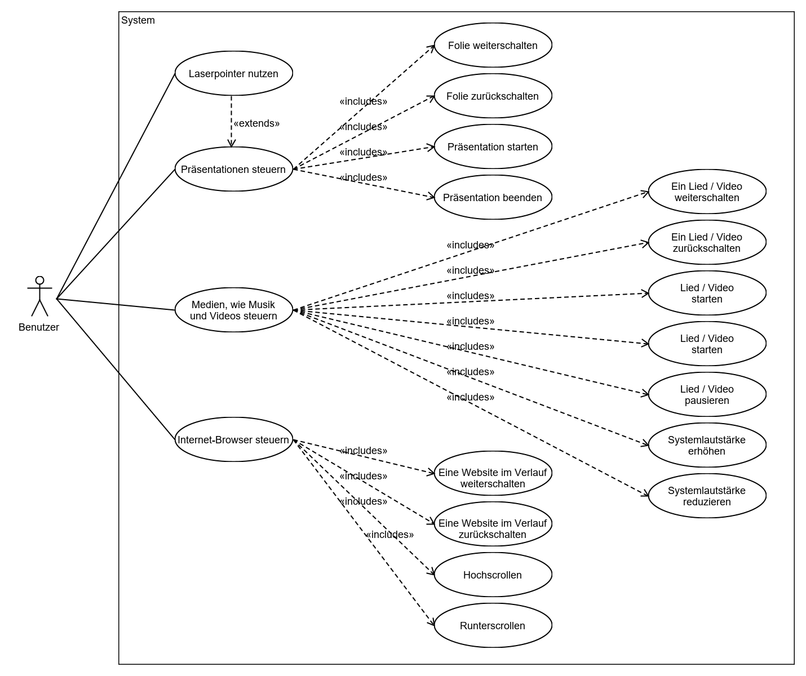

### 2.1.2 Anforderungsdiagramm
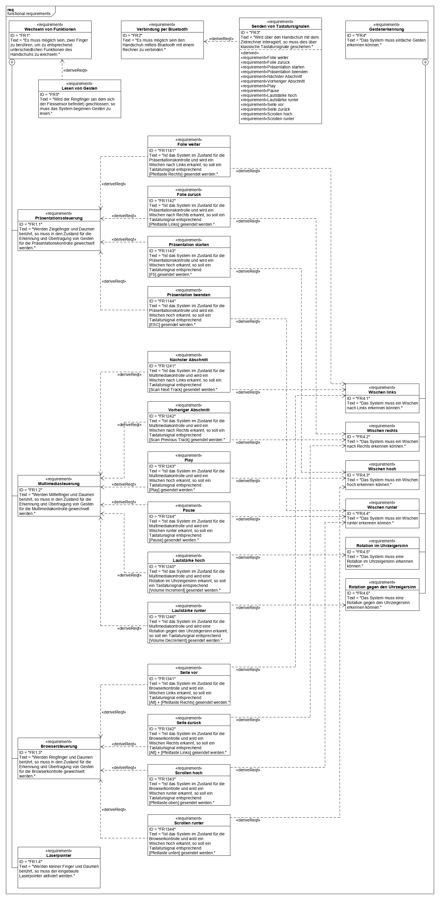

## 2.2 Nicht-funktionale Anforderungen

### 2.2.1 Anforderungsdiagramm

### 2.2.2 Rahmenbedingungen

#### Fremde Vorgaben
1. Als Kernelement soll der **M5Stack Core** (https://m5stack.com/) genutzt werden.
2. Als Framework für die Software-Entwicklung auf dem M5Stack, soll das **ESP-IDF** (https://github.com/espressif/esp-idf) genutzt werden.
3. Es sollen die Funktionalitäten von **FreeRTOS** (https://www.freertos.org/) genutzt werden, um Tasks zu erstellen und zu verwalten.
4. Als Programmiersprache (auf dem M5Stack) soll **C / C++** genutzt werden.

#### Eigene Vorgaben
1. Der E-Glove soll primär für Windows 10 - Rechner entwickelt werden.

# 3 Technische Beschreibung

## 3.1 Systemübersicht

### 3.1.1 Strukturdiagramm

### 3.1.2 Blockdefinitionsdiagramm: Physischer Aufbau

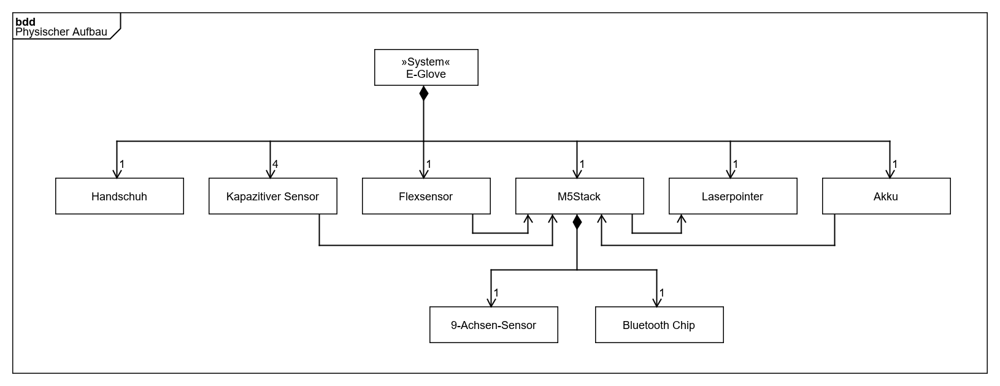

### 3.1.3 Kommunikationsprotokoll
Der E-Glove und der Zielrechner kommunizieren über Bluetooth, wobei der E-Glove als Server fungiert und der Zielrechner als Client.
Für den kompletten Ablauf der Kopplung zwischen Server und Client siehe 3.4, vereinfacht kann aber gesagt werden:
1. Der Server (E-Glove) bietet einen Service mit einer Charakteristik an.
2. Der Client (Zielrechner) sucht nach dem Service und abonniert dann die Charakteristik, um bei jeder Änderung des Wertes der Charakteristik benachrichtigt zu werden.
3. Der Server (E-Glove) schreibt Daten in die Charakteristik.
4. Der Client (Zielrechner) liest die Daten aus der Charakteristik.
5. Wiederhole ab 3.

**Werte, die in die Charakteristik geschrieben werden und welche virtuelle Taste sie auslösen:**

(Siehe "Microsoft Virtual-Key Codes" als Referenz: https://docs.microsoft.com/en-us/windows/win32/inputdev/virtual-key-codes)

| **Wert** | **Virtuelle Taste** | **Hexadezimalwert der virtuellen Taste** |
| :------ | :----- | :----- |
| 1 | RIGHT ARROW key | 0x27 |
| 2 | LEFT ARROW key | 0x25 |
| 3 | F5 key | 0x74 |
| 4 | ESC key | 0x1B |
| 5 | Next Track key | 0xB0 |
| 6 | Previous Track key | 0xB1 |
| 7 | Play/Pause Media key | 0xB3 |
| 8 | Volume Up key | 0xAF |
| 9 | Volume Down key | 0xAE |
| 10 | Browser Forward key | 0xA7 |
| 11 | Browser Back key | 0xA6 |
| 12 | UP ARROW key | 0x26 |
| 13 | DOWN ARROW key | 0x28 |

## 3.2 Verwendete Hardware

### M5Stack Core (+ Starter Kit)

 
https://m5stack.com/collections/m5-core/products/m5go-iot-starter-kit-stem-education

- Betrieben durch einen ESP32.
- Bietet viele bereits eingebaute Features an (z.B. LCD-Farbdisplay, 3 Tasten, Lautsprecher, ...).
- Für uns hauptsächlich relevant:
	- Bluetooth-Funktionalität (BLE).
		- Für die kabellose Kommunikation mit dem Zielrechner, der gesteuert werden soll.
	- 9-Achsen-Sensor
		- Das enthaltene Gyroskop, sowie der Beschleunigungssensor werden genutzt, um die Gesten zu erkennen.

### Flexsensor

 
https://www.antratek.de/flex-sensor-2-2?gclid=EAIaIQobChMIppH7n8m35QIVmMx3Ch376AAcEAQYAyABEgJ9efD_BwE

- An dem Ringfinger-Rücken besfestigt.
- Hat eine Länge von ca. 5,5 cm.
- Hat bei geradem Zustand einen geringen Widerstand und bei zunehmender Biegung erhöht sich auch der Widerstand.
- Wenn der Sensor (und damit der Ringfinger) gebogen ist, heißt dies, dass der Benutzer eine Geste zur Steuerung des Zielrechners ausführen will.

### Punkt Lasermodul

 
https://www.reichelt.de/punkt-lasermodul-rot-650-nm-03-6-vdc-9x20-mm-klasse-1-pico-70132441-p254487.html

- Mittels einer 3D-gedruckten Halterung am Zeigefinger befestigt
- Erweiternd zu den Präsentationsfunktionen des E-Glove als Zeigewerkzeug genutzt.

### Bluetooth USB 2.0 Adapter

 
https://www.reichelt.de/micro-bluetooth-usb-2-0-adapter-v4-0-edr-logilink-bt0015a-p170030.html?&trstct=pol_0

- Adapter, der dem angeschlossenen Rechner Bluetooth-Funktonalitäten verleiht.
- Für die Nutzung mit Rechnern, die keine eingebaute Bluetooth-Funktonalität besitzen.

### Kapazitiver Berührungssensor x4

 
https://www.reichelt.de/entwicklerboards-kapazitiver-beruehrungssensor-debo-touch-p253985.html

- Befestigt an allen Fingerspitzen, außer dem Daumen.
- Dienen zur Auswahl der verschiedenen Modi des Handschuhs ("Menüführung").
- Der Daumen ist bei dem E-Glove frei, mit diesem weden die Sensoren betätigt.

## 3.3 Erklärung anhand von Beispielbildern

### E-Glove (Oberseite)

 

### E-Glove (Unterseite)

 

### E-Glove (Seitenansicht)

 

### Kapazitive Sensoren in der Nahaufnahme

 

### Wechsel in den Präsentationsmodus

 

 

### Wechsel in den Multimediamodus

 

 

### Wechsel in den Browsermodus

 

 

### Wechsel in den Laserpointermodus

 

 

### Inaktiver Zustand (keine Gesten werden gelesen)

 

### Aktiver Zustand (Gesten werden gelesen)

 

## 3.4 Abläufe

### 3.4.1 Zustandsdiagramm des gesamten Systems

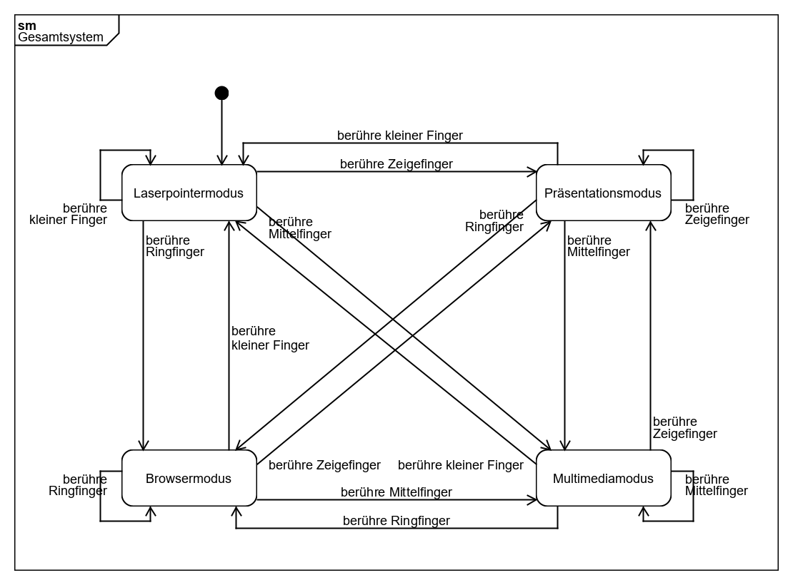

### 3.4.2 Zustandsdiagramm für Präsentations-, Multimedia- und Browsermodus

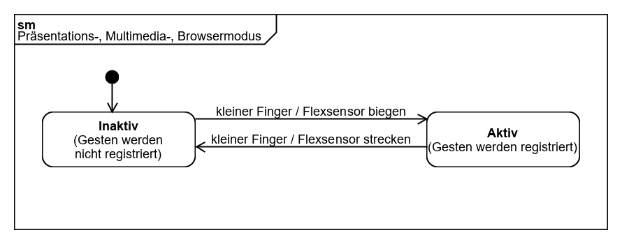

### 3.4.3 Zustandsdiagramm für den Laserpointermodus

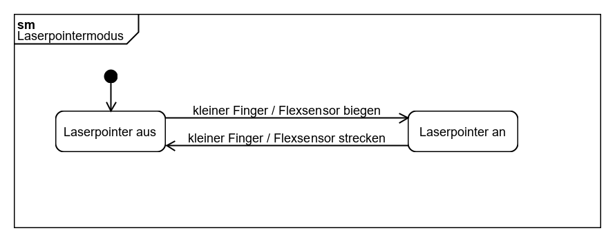

### 3.4.4 Sequenzdiagramm für die Auswahl des Modus

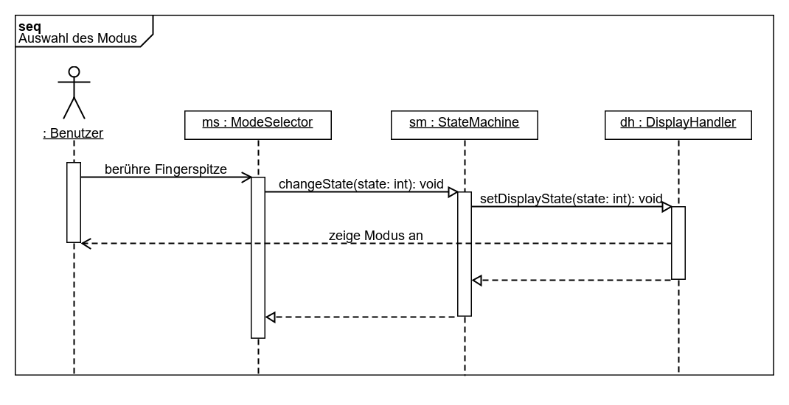

### 3.4.5 Sequenzdiagramm für das Ausführen einer Geste

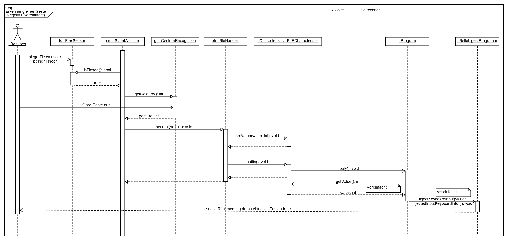

## 3.5 Entwurf

### 3.5.1 Klassendiagramm (vereinfacht)

### 3.5.2 Klassendiagramm (vollständig)

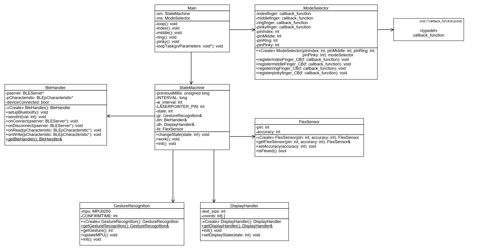

## 3.6 Entwurfsmuster / Programmier-Prinzipien

### 3.6.1 Verwendung des Singelton-Patterns

Da viele Komponenten bei multiplen Zugriffinstanzen Probleme verursachen können, wurde bei einigen Klassen das Singelton-Pattern genutzt.
In diesem Programm verwenden folgende Klassen das Singelton-Pattern:

* **BleHandler**
* **FlexSensor**
* **DisplayHandler**
* **GestureRecognition**

### 3.6.2 Objektorientierte Programmierung

Um eine bessere Datenkapselung und Zugriffskontrolle zu ermöglichen, wurde hauptsächlich objektorientierte Programmierung angewandt ([siehe Klassendiagramm](#_351-klassendiagramm-vereinfacht)).

## 3.7 Wichtige Bibliotheken, Frameworks und Schnittstellen

### E-Glove

### CXApp

- Input injection / Eingabeeinfügung
	- Dient der Simulation von Tastenanschlägen bzw. der Weiterleitung dieser an das System außerhalb des Programms.
	- Notwendig in der Sandbox von UWP-Apps.
	- Referenz:
		- https://docs.microsoft.com/de-de/windows/uwp/design/input/input-injection
		- https://docs.microsoft.com/de-de/uwp/api/windows.ui.input.preview.injection
- Windows Bluetooth API
	- Ermöglicht die Kommunikation eines UWP-Programm mit Bluetooth-Geräten.
	- Referenz:
		- https://docs.microsoft.com/de-de/uwp/api/Windows.Devices.Bluetooth

# 4 Projektorganisation

## 4.1 Grober Projektplan

### Meilenstein 1 (Bis: 18.11.2019)
Handschuh bauen und in die Komponenten einarbeiten.

### Meilenstein 2 (Bis: 02.12.2019)
Kabellose Verbindung zum Zielrechner herstellen und Signale übertragen.

### Meilenstein 3 (Bis: 30.12.2019)
Registrierung von Gesten.

### Meilenstein 4 (Bis: 13.01.2020)
Zusammenführung der Funktionen.

# 5 Probleme

## 5.1 Bluetoothkommunikation zwischen E-Glove und Zielrechner

Der ursprüngliche Plan war es, die Kommunkation zwischen E-Glove und Zielrechner ohne spezielle Software auf dem Zielrechner zu ermöglichen. Zu diesem Zweck sollte die Bluetooth-Funktionalität auf dem M5Stack so eingerichtet werden, dass dieser von dem Zielrechner als Bluetooth-Eingabegerät (z.B. Tastatur) erkannt wird. Auf diesem Weg wäre es möglich gewesen, alle für dieses Projekt relevanten Befehle direkt an den Zielrechner zu senden. Da allerdings Bibliotheken und dazugehörige Dokumentation für die Bluetooth-Funktionen auf dem M5Stack / ESP32 sehr begrenzt waren, war es uns nur möglich reguläre Character über diese Methode zu versenden, was für unsere Zecke nicht ausgereicht hätte.

Um den zeitlichen Rahmen dieses Projekts einhalten zu können, mussten wir uns somit umorientieren und einen Workaround entwickeln. Wir entschlossen nun doch eine (möglichst kompakte) Software auf dem Zielrechner zu verwenden. Allerdings hat sich schnell gezeigt, dass auf Windows - Systemen die meisten Programme und Skripte nicht mit den Bluetooth-Funktionen des Systems interagieren können, da diese von Windows gekapselt werden.
Somit stellte sich heraus, dass eine der wenigen Möglichkeiten der Interaktion (auf Programmebene) mit den Bluetooth-Schnittstellen von Windows ist, eine sogenannte UWP-App (universelle Windows-Plattform Applikation https://docs.microsoft.com/de-de/windows/uwp/get-started/universal-application-platform-guide) zu entwickeln.

Diese Anwendung ist in C# geschrieben und ist auch im Repository dieses Projekts zu finden, unter "CXApp". Da es sich hierbei um einen Workaround handelt, ist die Anwendung möglichst einfach gehalten.

# 6 Anhänge

## 6.1 CAD-Dateien

### 6.1.1 M5stack Halterung:

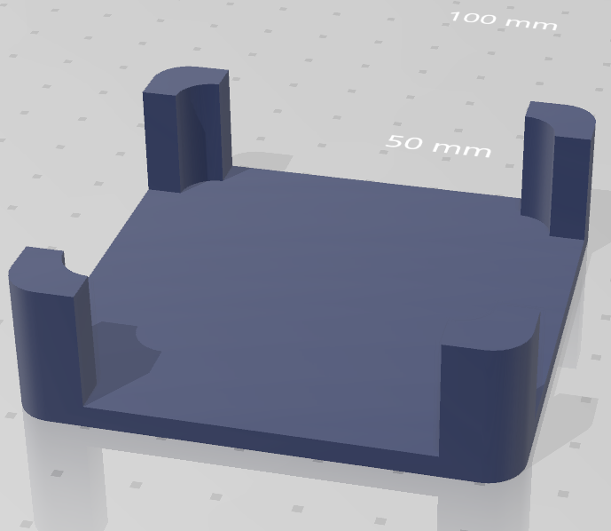

### 6.1.2 Laserpointer Halterung:

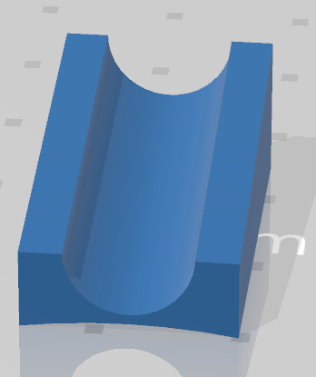

## 6.2 Glossar

### Charakteristik

https://www.bluetooth.com/specifications/gatt/characteristics/

Eine Charakteristik ist im Bluetooth-Kontext ein Attribut eines Bluetooth-Service (siehe unten), welches einen bestimmten Wert hält. Diese Charakteristika können dann beispielsweise von einem anderen System, welches sich mit dem Bluetooth-Gerät verbunden hat, ausgelesen oder beschrieben werden. So kann ein Bluetooth-Server (siehe unten), welcher den Service mit den Charakteristika besitzt, mit einem Bluetooth-Client (siehe unten) hin und her kommunizieren.

### Client

Ein Client ist im Bluetooth-Kontext ist ein System, welches sich mit einem Bluetooth-Server (siehe unten) verbindet um auf diesem von Charakteristika (siehe oben) zu lesen bzw. diese zu beschreiben.

### E-Glove

Der Begriff E-Glove umfasst das Gesamte Projekt welches in diesem Dokument beschrieben wird. In speziellen Fällen wird dieser Begriff aber auch genutzt, um auf das Kontrukt des Handschuhs samt zugehöriger Elektronik (M5Stack, Sensoren, ...) im speziellen zu verweisen. Dies geschieht hauptsächlich wenn die Begriffe "E-Glove" und "Zielrechner" (siehe unten) differenziert werden sollen.

### Server

Ein Server ist im Bluetooth-Kontext ist ein System, welches gewisse Services (siehe unten) und dazugehörige Charakteristika (siehe oben) besitzt. Mit dem Server können sich ein oder mehrere Clients (siehe oben) verbinden und von den Charakteristika lesen bzw. diese beschreiben um so mit dem Server und / oder gewissen anderen Clients zu kommunizieren.

### Service

https://www.bluetooth.com/specifications/gatt/services/

Ein Service ist im Bluetooth-Kontext eine Ansammlung von Charakteristika (siehe oben) und Beziehungen zu anderen Services. Services können so einen Teil des Verhaltens eines Bluetooth-Geräts darstellen.

### UWP-App / UWP-Programm

https://docs.microsoft.com/de-de/windows/uwp/get-started/universal-application-platform-guide

Eine UWP-App ist eine Windows-spezifische Anwendung, der es möglich ist restriktierte Schnittstellen des Windows-Betriebssystems zu nutzen. Diese Anwendungen müssen einigen Prinzipien folgen, die u.a. für erhöhte Sicherheit sorgen, da diese Anwendungen hauptsächlich für den Vertrieb über den Windows-Store gedacht sind. So läuft eine solche Anwendung beispielsweise permanent in einer Sandbox und Zugriffe, die aus dieser Sandbox herausgehen, müssen von dem jeweiligen Nutzer genehmigt werden.

### Virtuelle Taste

Virtuelle Tasten sind eine Funktionalität von Windows-Betriebssystemen, um Tastenanschläge von u.a. Tastaturen über Software zu simulieren. Dafür existieren Zahlenwerte die die Tasten repräsentieren und Bibliotheken, um diese an das Betriebssystem weiterzuleiten.
Referenz der Virtuellen Tasten und welche Werte sie haben:

https://docs.microsoft.com/en-us/windows/win32/inputdev/virtual-key-codes

### Wearable

https://de.wikipedia.org/wiki/Wearable_Computing

Unter "Wearables" versteht man im Bereich der IT Computersysteme, die die Form eines Kleidungsstücks annehmen oder in Kleidungsstücke eingearbeitet sind. Ein Wearable wird also vom Anwender während der Benutzung am Körper getragen.

### Zielrechner

Der Zielrechner ist im Kontext dieses Projekts der Rechner, mit dem der E-Glove verbunden wird. Auf diesem Rechner findet dann z.B. auch die Präsentation statt, die über den E-Glove kontrolliert werden soll.

